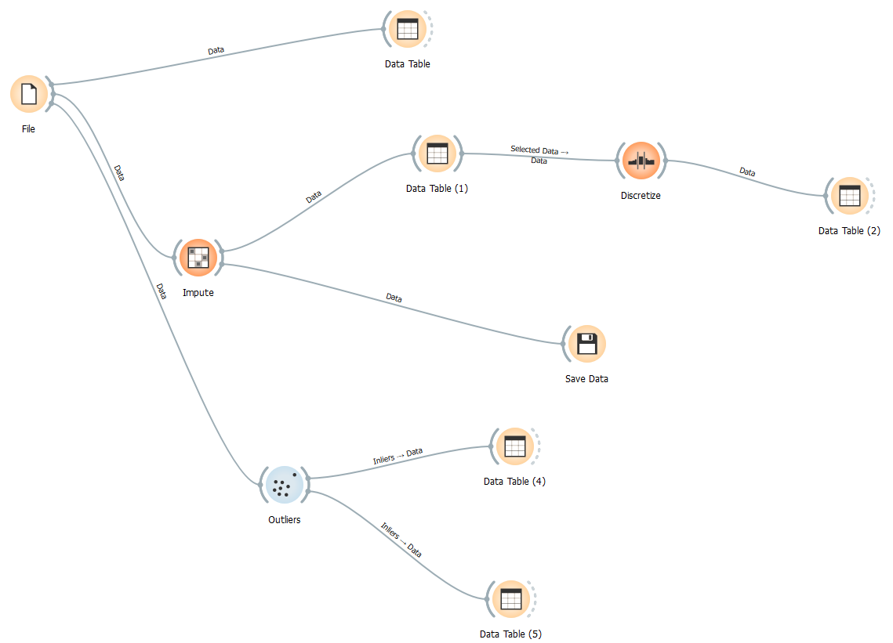
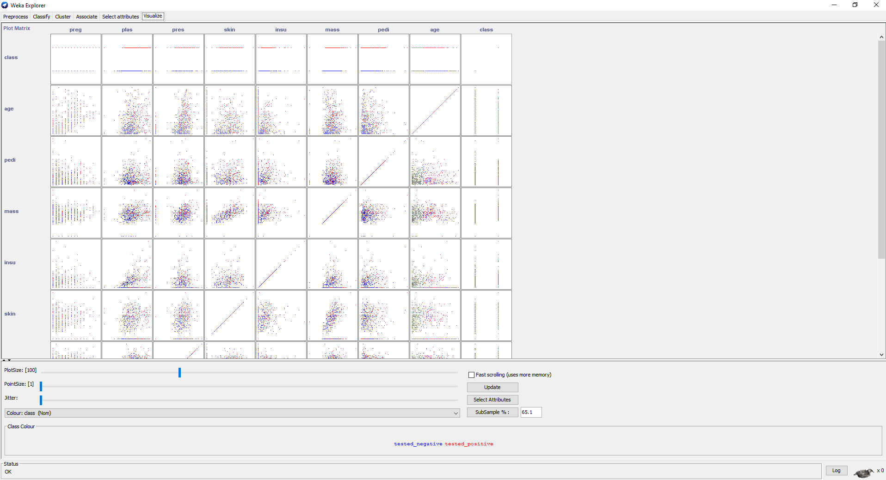
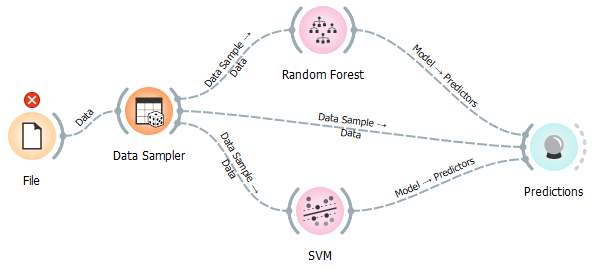

# Lis4761 - Data Mining and Analytics

## Tanner Morlan

### Course Description:

- This course provides an introduction to data analytics, which is defined as the extensive use of data, statistical and quantitative analysis, predictive and exploratory models to drive decisions and actions. Students will learn basic concepts and essential algorithms for data analytics, including data cleaning, association rule mining, data warehousing, predictive modeling, clustering, and text mining.  Students will also learn to use mainstream tools such as Weka, Orange Data Mining, MetaMap, and Tableau to solve data analytics problems with real-world datasets. Further, the students will evaluate the data analytics models, interpret the results, and understand their limitations. The students will form groups, conduct a project of data analytics, and use the tools introduced in the course to tackle the problem.

### Notable Assignments:

*Data Exploration*

- Uses Google Colab

[Assignment](https://colab.research.google.com/drive/1sBKmtHWcpLB8NBoR6L-jJrb2Sst5N-Wv?usp=sharing)

*Exercise 2: Data Cleaning*

- Uses Orange Datamining

*Exercise 5: Diabetes Analysis*

- Uses Weka

*Final Project Predictive Analysis*

- Uses Orange Datamining

